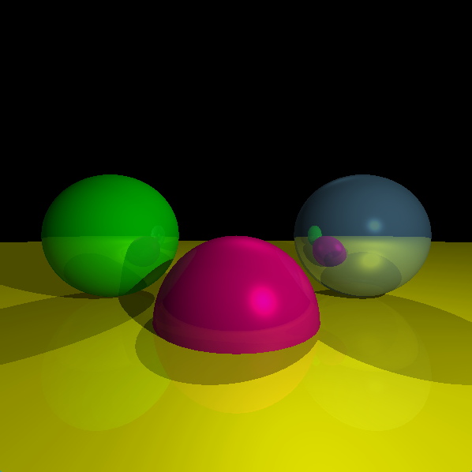
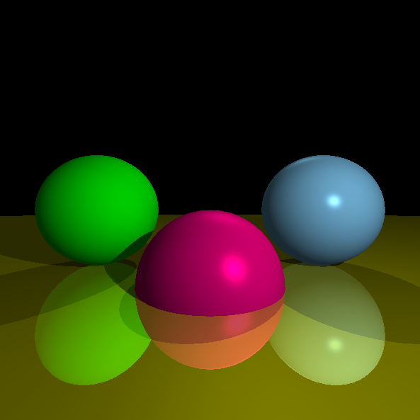
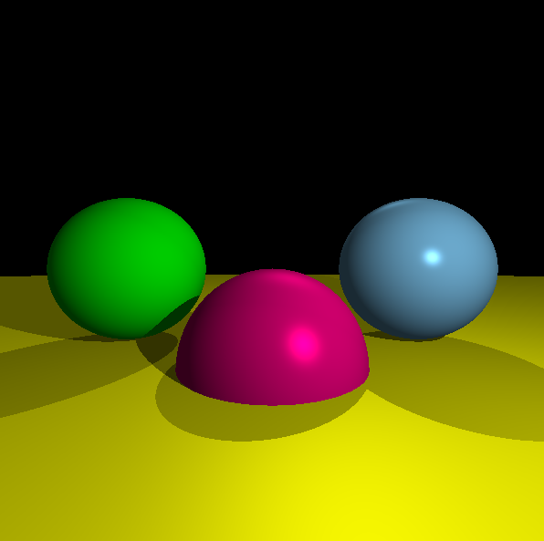

# C++ Ray Tracer

A recursive ray tracer written in C++ from scratch, following Gabriel Gambetta's *Computer Graphics from Scratch*. Renders scenes of spheres with realistic lighting, shadows, and mirror reflections, displayed in real time through SFML 3.



## About this project

This is a personal project I built to bridge my background in hardware and lower-level programming with my interest in computer graphics. Most of my coursework as a senior in Computer Engineering at USF has been in hardware, embedded systems, and general-purpose programming in Python, C, and C++ — usually without external libraries beyond the standard library. This ray tracer is the start of a longer effort to build a competitive portfolio in the computer graphics space.

I implemented every algorithm from the book's pseudocode myself, working through the math (ray-sphere intersection, Phong illumination, recursive reflection) and translating it line by line into C++. The only external dependency is SFML 3, which handles the window and pixel output — all rendering logic is my own code.

## Features

- Perspective projection through a virtual viewport
- Ray-sphere intersection via the closed-form quadratic
- Scene composition with multiple spheres and lights
- Three light types: ambient, point, and directional
- Lambertian diffuse shading
- Phong specular highlights with per-material shininess
- Shadow rays with epsilon-offset self-intersection prevention
- Recursive mirror reflections with configurable depth
- Real-time display through SFML 3 with persistent window/event loop

## Sample renders

A render of three spheres on a reflective floor, showing diffuse shading, specular highlights, shadows, and recursive reflections:



The same scene without reflections enabled, showing pure Phong shading and shadows:



## Building

Requires:
- A C++17 compiler
- SFML 3.x

### Linux / macOS

```bash
g++ -std=c++17 -O2 main.cpp functions.cpp -o raytracer \
    -lsfml-graphics -lsfml-window -lsfml-system
./raytracer
```

Make sure the SFML link flags come *after* the source files on the command line, or the linker will produce "undefined reference" errors.

### Windows (Visual Studio)

Open the solution and build. Make sure SFML's `include` and `lib` directories are configured in the project's properties, and that `sfml-graphics.lib`, `sfml-window.lib`, and `sfml-system.lib` are listed under linker input.

## How it works

The renderer walks every pixel on the canvas and casts a ray from the camera through that pixel into the scene. For each ray:

1. `ClosestIntersection` finds the nearest sphere the ray hits, if any
2. If nothing is hit, the background color is returned
3. Otherwise, the hit point and surface normal are computed
4. `ComputeLight` sums contributions from each light source — ambient, plus diffuse and specular terms for directional and point lights — with shadow rays cast toward each light to test for occlusion
5. If the surface is reflective, a new ray is traced in the reflected direction (bounded by recursion depth) and blended with the local color

Reflection recursion is capped at depth 3 by default. The bounded recursion is what allows mirror-like surfaces to reflect each other without infinite loops.

## Project structure

| File | Purpose |
| --- | --- |
| `structs.hpp` | Type definitions: `Vec3`, `Color`, `Sphere`, `Light`, `LightType` |
| `functions.hpp` | Function declarations, scene constants, camera parameters |
| `functions.cpp` | Ray tracing logic, lighting, intersection tests |
| `main.cpp` | Window setup, pixel iteration, event loop |

`Vec3` overloads arithmetic operators for clean vector math, and `Color` clamps its channel values on every operation so that bright highlights or reflective blending can't overflow the 0–255 range.

## Tuning the scene

Scene parameters live in `functions.cpp` as `const std::vector<Sphere>` and `const std::vector<Light>`. Each sphere takes a center, radius, color, specular exponent, and reflectivity factor:

```cpp
{{0, -1, 3}, 1, {255, 0, 134}, 500, 0.1}
//   center     R    color       spec  refl
```

- **Specular exponent**: higher = tighter, brighter highlight (500–1000 for shiny, 10 for matte, -1 to disable specular entirely)
- **Reflectivity**: 0 = no reflection, 1 = perfect mirror, intermediate values blend

Changing these values and re-running is the fastest way to experiment with the renderer's behavior.

## What's next

The book continues into Chapter 5 (arbitrary camera positioning and rotation, transparency, anti-aliasing) which I plan to work through next. Beyond the book, I'm interested in:

- Anti-aliasing via supersampling
- Triangle meshes loaded from OBJ files
- Bounding volume hierarchies for performance on larger scenes
- Eventually moving the renderer to the GPU

## Tuning the performance

- **Multithreading**:

This is my first addition to the project outside of the scope of the textbook. Ray tracing is notoriously slow and compute heavy; to chip away at this downside of ray tracing, I have multithreaded the main loop where each ray is "traced". I did this mainly with the execution policy library to automatically handle this repetitive compute heavy loop. This is both faster and cleaner than manually managing threads using the the thread library. I also use other quality-of-life cstd libraries to make thread distribution simpler.

## Reference

Gambetta, Gabriel. *Computer Graphics from Scratch: A Programmer's Introduction to 3D Rendering*. No Starch Press, 2021. Available free online at [gabrielgambetta.com/computer-graphics-from-scratch](https://gabrielgambetta.com/computer-graphics-from-scratch/).
